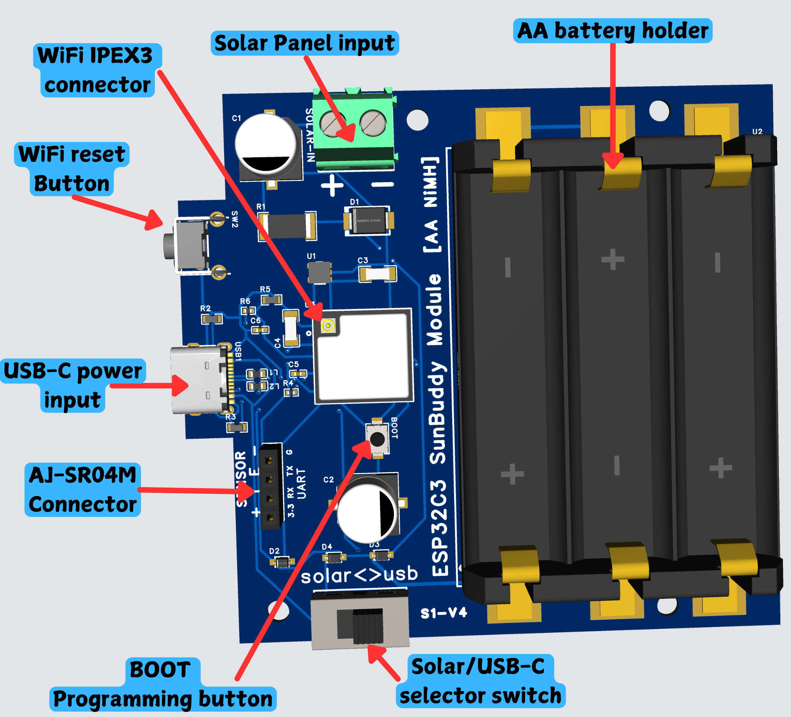
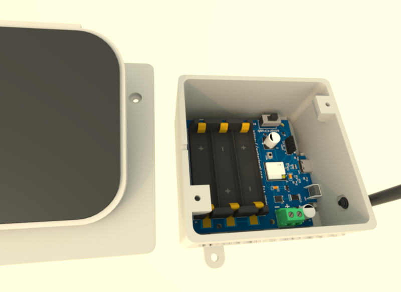
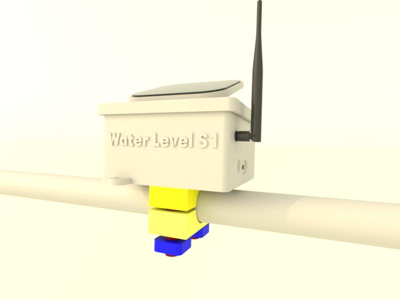
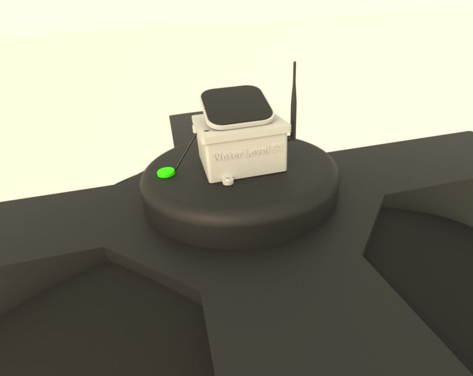

# WiFi Water Level S1

The **WiFi Water Level S1** is an advanced water level monitoring device designed to deliver precise
measurements for various applications, including tanks, wells, and reservoirs. 
Utilizing WiFi connectivity, it enables real-time monitoring and management of water levels from anywhere via a 
smartphone or computer. Powered by **solar energy**, the device is completely wireless and autonomous.

Additionally, it integrates seamlessly with the [Automatic Water Pump for S1 project](https://oshwlab.com/rrguardo83/automatic-water-pump-for-s1), allowing for 
automatic control of a water pump based on the sensor's data. This integration enhances the system's 
efficiency by automating water management processes.

Please note that this is an incomplete ongoing project. I am moving it from a working project on the development board to 
certified production chips and new SMD components, for easy assembly and production.

The project is open source and open hardware, licensed under GPLv3. All hardware, software, and
3D printable components were designed from scratch by me, **Raul Rodriguez Guardo**, and are released 
under the GPLv3 license, allowing for free use and modification.

  
  

[Real S1 Device Demo](https://waterlevel.pro/device_info?public_key=demo)

  

### Device Size and Weight

* Weight 370 grams (0.8 pounds) including batterries and AJ-SR04M sensor
* Weight 260 grams (0.57 pounds) without batterries or  AJ-SR04M sensor
* Main case box size 90 milimeters X 56 milimeters without including mount or WiFi antena.

### Device Compatible Sensors

* All **HCSR04** sensors family, that can work with **3.3V**
* **AJ-SR04M** recomended for water tanks or places of extreme humidity.
* **RCWL-1670** is compatible, but will need special waterproff case if will be placed inside water tanks. 

### Device Compatible Solar Panels

* Tested with 5.5 V, 130 mA Solar Panel
* Don't use solar panels that pass the 250 mA or 5.5V

## Microcontroller Software

[ArduinoIDE INO File](WiFiWaterLevelS1.ino)

This devide use ESP32-C3 microcontroller can use Arduino IDE to flash/upload microcontroller code, using **ESP32C3 Dev Module** as board.

Before upload the code, generate a new private and public keys in developer zone at https://waterlevel.pro/settings  https://waterlevel.pro/add_sensor

## Server Side Minimal Sample in Python

Note [WaterLevel.Pro](https://waterlevel.pro/) offer this server side service free, 
but you can make your own server using the sample provided.

[Server sample that process and show sensor data](demo_server.py)

---

## Hardware part at OSHWLab (ongoing)

https://oshwlab.com/rrguardo83/water-level-.pro-s1-v2

### Where buy the PCB board?
[At OSHWLab project, opening the EasyEDA](https://oshwlab.com/rrguardo83/water-level-.pro-s1-v2) 
editor can in few click buy the entire board with all the PCB components including the components assembly, 
directly from **JLCPCB** and **LCSC** services.

### PCB Component Roles Diagram

---
## FreeCad 3D printable case components

[3D printable case components](3dcase)

For more details about important 3d printing recommendations 
 [read this tips](3dcase/3DPrintReadme.md).

---
## Mount options samples
### Pipe mount

### Water tank lid mount

## Disclaimer

This open-source electronics project is provided **"as is."** No warranties of any kind, 
either express or implied, including but not limited to implied warranties of 
merchantability or fitness for a particular purpose, are made. Use this project at 
your own risk. We are not responsible for any damage, loss, or inconvenience that 
may arise from the use of this project.

## Compliance Description for Open Hardware Device

This open hardware device **does not have formal FCC, CE, or a Declaration of Conformity (DoC)** 
as an independent product, as it has been designed under the principles of free distribution and 
community use. However, the core component used in this device is the **ESP32-C3-MINI-1U-H4**, which 
has already been [pre-certified by the FCC and others](https://www.espressif.com/en/support/documents/certificates?keys=&field_product_value%5B%5D=ESP32-C3-MINI-1U), and complies with regulatory requirements.

- **FCC ID of the ESP32-C3-MINI-1U-H4:** 2AC7Z-ESP32C3MINI1
- **CE Certification:** This module complies with European CE regulations.
- **SRRC Certification in China and MIC Certification in Japan:** Ensuring compatibility in these regions.

For those interested in assembling this device, we recommend using **JLCPCB** and **LCSC** services, which 
are recognized suppliers in the electronics industry. Both offer high-quality components and services, and 
many of their parts come with certifications that ensure safety and regulatory compliance, contributing to 
the reliability of the final product.

