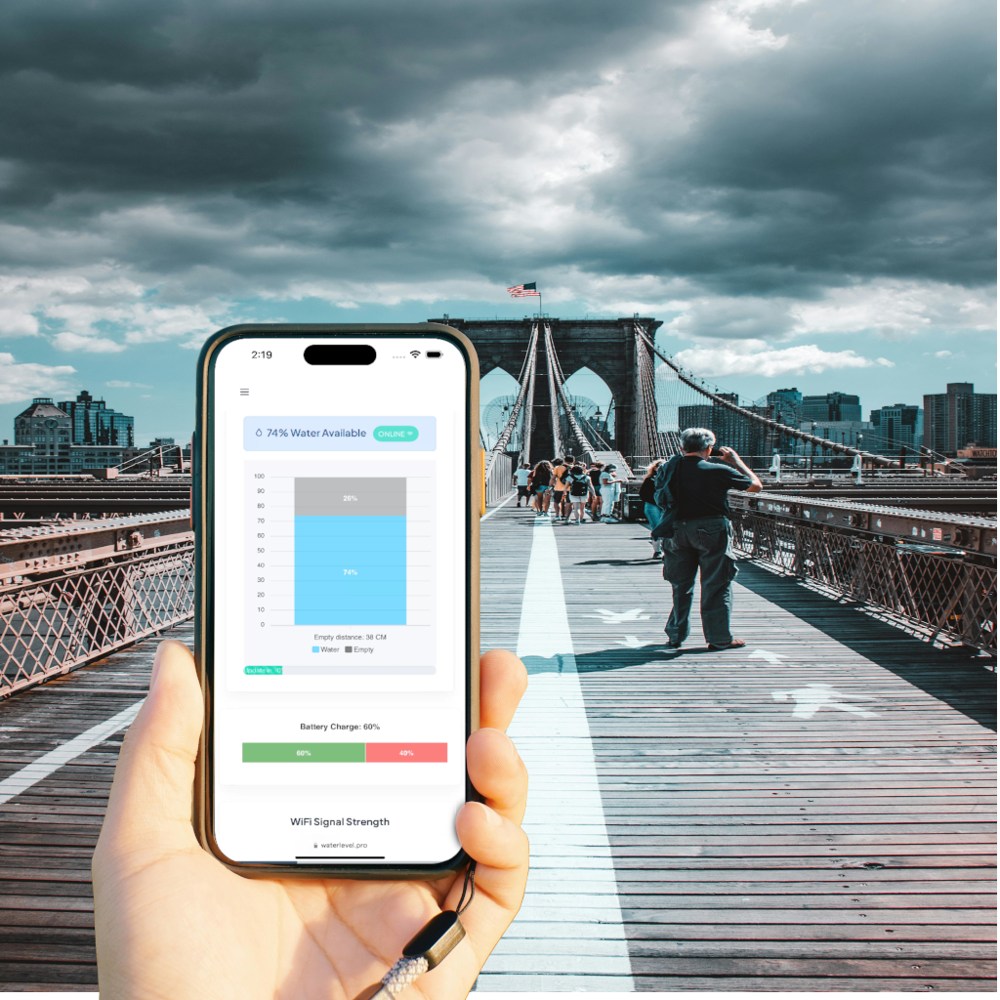

# WiFi Water Level S1

The **WiFi Water Level S1** is an advanced water level monitoring device designed to deliver precise
measurements for various applications, including tanks, wells, and reservoirs. 
Utilizing WiFi connectivity, it enables real-time monitoring and management of water levels from anywhere via a 
smartphone or computer. Powered by **solar energy**, the device is completely
wireless and autonomous. 

The system is cloud-connected, requiring an internet connection, and is designed for reliable, continuous operation.
For more details, refer to the [full features page](https://waterlevel.pro/products/WiFi-Water-Level-S1).

Additionally, it integrates seamlessly with the [WiFi Smart Water Pump Controller S1](https://github.com/rrguardo/WiFi-Smart-Water-Pump-Controller-S1), allowing for 
automatic control of a water pump based on the sensor's data. This integration enhances the system's 
efficiency by automating water management processes.

The project is open source and open hardware, licensed under GPLv3. All hardware, software, and
3D printable components were designed from scratch by me, **Raul Rodriguez Guardo**, and are released 
under the GPLv3 license, allowing for free use and modification.

  
  

[Real S1 Device Demo](https://waterlevel.pro/device_info?public_key=demo)

  

### Device Compatible Sensors

* All **HCSR04** sensors family, that can work with **3.3V**
  *   **AJ-SR04M** recommended for water tanks or places of extreme humidity.
  *   **RCWL-1670** is compatible, but will need special waterproof case, if will be placed inside water tanks. 
* UART Distance sensors , that can work with **3.3V** (Not tested yet, experimental)
  *   **A02YYUW** recommended for water tanks or places of extreme humidity. 
  Offer a range of 3-450 CM, with an small 3 CM blind area.

**Note:** UART sensors have not been tested with this device yet and are currently in the experimental phase. 
To enable UART (A02YYUW), add or uncomment `#define UART_SENSOR`. Refer to the schematic or the PCB layout image 
to identify the RX/TX pins.

### Device Compatible Solar Panels

* Tested with 5.5 V, 130 mA Solar Panel (5.5V 130mA 72x72mm) https://www.aliexpress.us/item/3256804502745527.html using D1 5V zener. 
* Don't use solar panels that pass the 250 mA or 5.5V

## DIY Guide

For a detailed guide on how to build this project, check out the full tutorial at [Instructables](https://www.instructables.com/Build-Your-Own-DIY-WiFi-Water-Level-Sensor-S1/).

## Microcontroller Software

[ArduinoIDE INO File](WiFiWaterLevelS1/WiFiWaterLevelS1.ino)

This devide use ESP32-C3 microcontroller can use Arduino IDE to flash/upload microcontroller code, using **ESP32C3 Dev Module** as board.

[Download Latest Firmware Builds Here](WiFiWaterLevelS1/firmwares/)

## Server Side Minimal Sample in Python

Note [WaterLevel.Pro](https://waterlevel.pro/) offer a more advanced server side service free, 
but you can make your own server using the sample provided as a minimal sample. 

[Server sample that process and show sensor data](demo_server.py)

Pending TODO: Improve the opensource Server Side Minimal Sample UI.

---

## Hardware part at OSHWLab

[SunBuddy-C3 Module](https://oshwlab.com/rrguardo83/water-level-.pro-s1-v2)

### Where buy the PCB board?
[At EasyEDA project](https://waterlevel.pro/short/sunbuddy)
editor click **Order** menu.

### PCB Component Roles Diagram

---
## FreeCad 3D printable case components

[3D printable case components](3dcase)

For more details about important 3d printing recommendations 
 [read this tips](3dcase/3DPrintReadme.md).

### No 3D Printer? No Problem! Easily Print Parts Using Online 3D Printing Service

| **3D Print Provider**             | **Recommended Materials for Outdoors**                | **Approximate Price**        | **Print Quality**               | **Delivery Options**          | **Comments**                                              |
|--------------------------|-------------------------------------------------------|------------------------------|----------------------------------|-------------------------------|-----------------------------------------------------------|
| **JLCPCB (JLC3DP)**       | Nylon (PA12)                                          | Low to Medium                 | High for resin and MJF           | International, economical      | Great value for money, lacks PETG or ASA options           |
| **Shapeways**             | Nylon, Stainless Steel, Aluminum                      | Medium to High                | Very high, detailed              | International, fast            | Ideal for high-detail projects and outdoor durable parts   |
| **Sculpteo**              | Nylon (PA12), Aluminum, Carbon-Reinforced Nylon       | Medium                        | High                             | International, fast options     | Wide range of materials, good for durable prototypes       |
| **3D Hubs**               | PETG, ABS, Nylon, Carbon Fiber-Reinforced Materials   | Medium                        | High, varies by local provider   | International, varies           | Global network, quality and delivery times vary by provider|
| **Craftcloud**            | PETG, Nylon, ASA, Carbon Fiber-Reinforced Materials   | Medium                        | High, varies by provider         | International, varies           | Service aggregator, good price comparison across providers |
| **Materialise**           | Nylon (PA12), Carbon-Reinforced Nylon, Metals         | High                          | Very high, industrial focus      | International, fast             | Focus on industrial and professional applications          |
| **Xometry**               | Nylon, ABS, PETG, Aluminum, Carbon-Reinforced Nylon   | Medium to High                | Very high, professional focus    | International, fast             | Ideal for custom manufacturing and durable industrial parts|

Choose durable materials like **PETG** for outdoor use, and set **infill at 60%** or higher for added strength. Just upload the 3D files and get everything printed and shipped to you!

---
## Mount options samples
### Pipe mount

### Water tank lid mount

---
## User Installation Manual

The [installation manual](https://waterlevel.pro/manuals/WiFi-Water-Level-S1) provides 
detailed instructions on setting up the WiFi Water Level S1. 
Be sure to [read all instructions](https://waterlevel.pro/manuals/WiFi-Water-Level-S1) 
carefully before proceeding with the installation to ensure proper 
setup and functionality.

[WiFi Water Level S1, Installation Manual](https://waterlevel.pro/manuals/WiFi-Water-Level-S1)

---

## What parts are opensource?

* All the hardware part
  * Electronics part: PCB, schematic.
  * Printable 3D Case
* Firmware software
* [Server sample that process and show sensor data](demo_server.py)

The server side implementation at https://waterlevel.pro/ (cloud services) that use the device are not 
included in this project or git repo and are not opensource.

---

## Next TODO:

* Add basic DIY Guide
* Improve the opensource server sample
  * UI
* ...

---

## Important Disclaimer

> **Disclaimer:**  
This open-source electronics project/device is provided strictly for experimental, educational, and developmental purposes. It is offered "as is," without any warranties, express or implied. This includes, but is not limited to, implied warranties of merchantability, fitness for a particular purpose, or non-infringement.
> 
Users are solely responsible for ensuring that the use of this device complies with local laws, regulations, and safety standards in their region.

---

  <h5>Designed in the Dominican Republic 2024-2025</h5>
  

---
